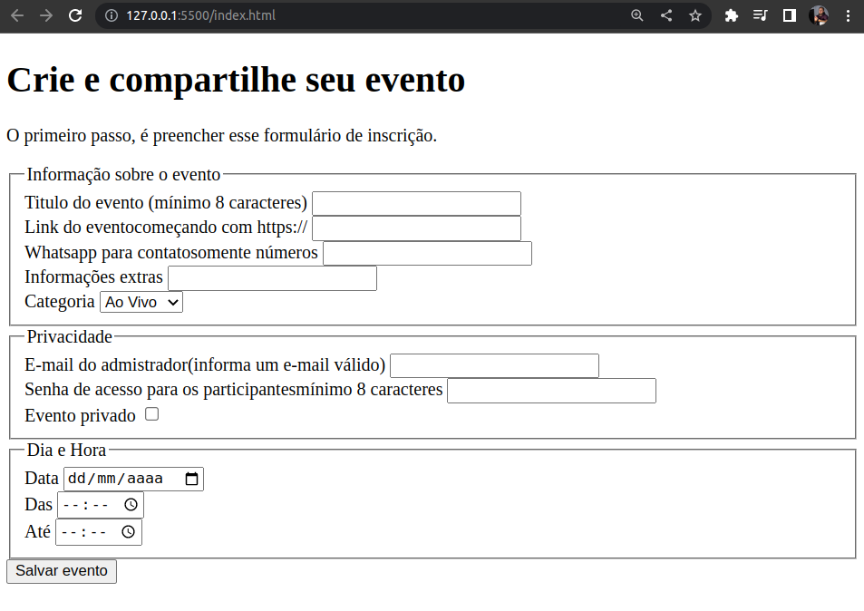
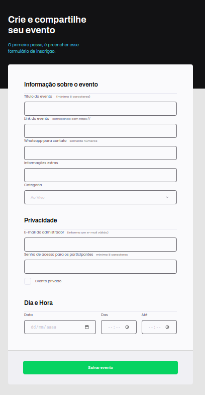

<h1 align="center"> Desafio #01 - Formulario </h1>

 

<h2>Sem CSS</h2>

  

<h2>Com CSS</h2>

  

---
## 🚀 Tecnologias

Esse projeto foi desenvolvido com as seguintes tecnologias:

- HTML e CSS

---
## 💻 Projeto

Projeto desenvolvido durante aula do Explorer 

---
## 🔖 Layout

Você pode visualizar o layout do projeto através [DESSE LINK](https://www.figma.com/file/bPiDvJSKNYOy68HKf61XSL/Explorer-Stage-03-Projeto-01?node-id=0%3A1&t=SbmagfWM1bvUe0TZ-1). É necessário ter conta no [Figma](https://figma.com) para acessá-lo.

---

